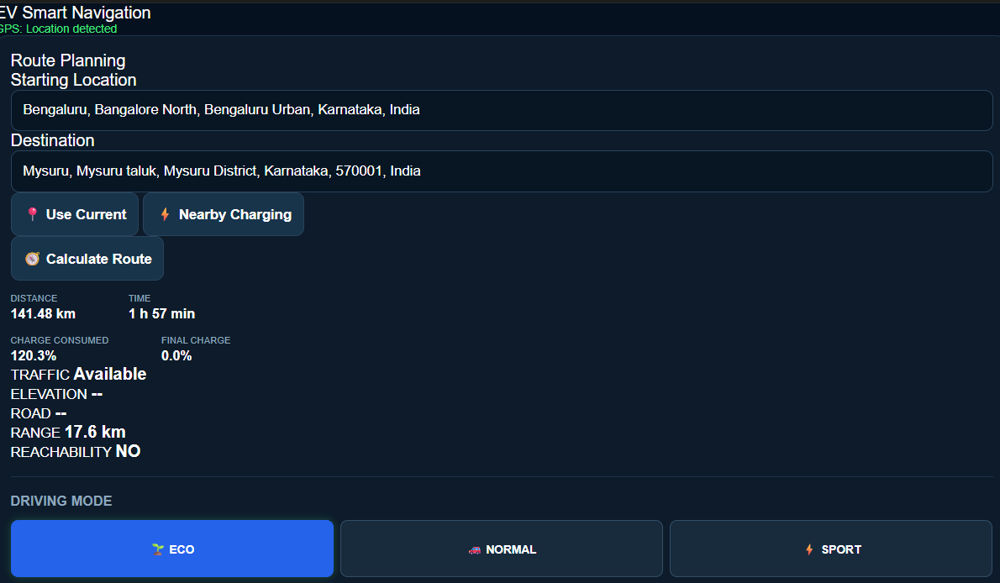
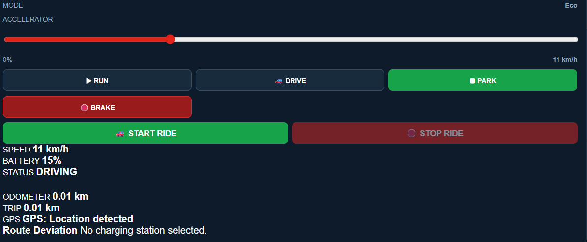
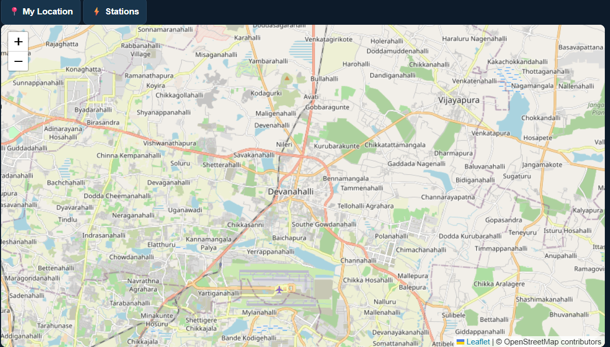

# Adaptive EV Range Estimation & Smart Navigation

A web-based Electric Vehicle (EV) Smart Navigation and Range Estimation prototype designed to combine route planning, EV charging-station discovery, battery-range estimation, and simulated driving information in a single application.

## Screenshots

### EV Smart Navigation Dashboard



### Route Planning and Range Estimation




### EV Charging Stations




## Project Overview

Electric vehicle range can vary depending on driving conditions, speed, vehicle load, auxiliary power consumption, and other real-world factors. This project explores an adaptive approach to EV range estimation while providing navigation and charging-station assistance.

The current software prototype provides route planning, location search, charging-station discovery, battery/range estimation, and a simulated EV dashboard. The system is designed for future integration with real-time vehicle parameters obtained through an ESP32-based hardware system.

## Key Features

- Current-location detection using browser GPS
- Location and destination search
- Interactive map using Leaflet and OpenStreetMap
- Route calculation with distance and estimated travel time
- EV battery consumption and remaining-range estimation
- Eco, Normal, and Sport driving modes
- Simulated vehicle speed, battery, trip distance, and odometer
- Nearby EV charging-station discovery
- EV charging-station information using Open Charge Map
- Route visualization on an interactive map
- Django REST-style API endpoints for frontend-backend communication
- Responsive web-based user interface

## Technologies Used

### Backend
- Python
- Django
- Requests
- SQLite

### Frontend
- HTML5
- CSS3
- JavaScript
- Leaflet.js

### APIs and Services
- OpenStreetMap
- Nominatim API
- OSRM Routing API
- Open Charge Map API
- Browser Geolocation API

## System Workflow

```text
User
 |
 v
Web Interface
 |
 +--------------------+
 |                    |
 v                    v
Location Search     Current GPS
 |                    |
 +---------+----------+
           |
           v
     Route Planning
           |
           v
      OSRM Routing
           |
     +-----+-----+
     |           |
     v           v
Route Distance  Travel Time
     |
     v
EV Range Estimation
     |
     +-------------------+
     |                   |
     v                   v
Battery Estimate    Reachability
     |
     v
Charging Station Search
     |
     v
Open Charge Map
```